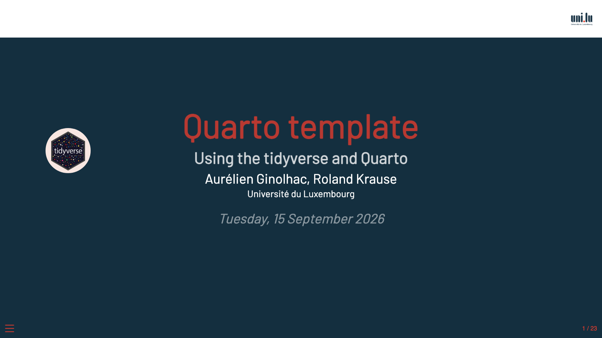

# Quarto reveal.js uni.lu template


A [Quarto](https://quarto.org) extension for authoring [r-training](https://gitlab.com/uniluxembourg/lcsb/r-training) Reveal.js presentations at [University of Luxembourg](https://wwwen.uni.lu/)

Fontawesome is used for icons in callout boxes.

## Installation

- To start a new presentation in a new folder:

``` bash
quarto use template ginolhac/unilu-theme
quarto add quarto-ext/fontawesome --embed ginolhac/unilu-theme
```

- To install the theme in an existing folder:

``` bash
quarto install extension ginolhac/unilu-theme
quarto add quarto-ext/fontawesome --embed ginolhac/unilu-theme
```

## Title slide logo

Each deck's own logo sits in a circular badge to the left of the title. Set only `data-background-image` in `title-slide-attributes`:

``` yaml
title-slide-attributes:
  data-background-image: https://tidyverse.tidyverse.org/logo.png
```

Position and size are fixed by the theme itself (`$title-logo-x`/`$title-logo-y`/`$title-logo-size` in `lectures.scss`), so a per-document `data-background-position` or `data-background-size` has no effect.

## Linked logo

Following discussion on [quarto-cli](https://github.com/quarto-dev/quarto-cli/discussions/3082#discussioncomment-7058099), logo on each slide can point to the desired URL.

Set it in the YAML header with `logo_url: "https://fasterthanli.me"`

If not set, it points to https://quarto.org


## Output



Preview this [Quarto reveal.js theme](https://rolandkrause.github.io/unilu-theme) on `gh-pages`.

## Styling and usage

Ideas for the use of the slide styling is in the template.


## Acknowledgements

-   [Romain Lesur](https://github.com/RLesur) for the [onyxia-quarto template](https://github.com/InseeFrLab/onyxia-quarto) 
-   [Mickaël Canouil](https://github.com/mcanouil/) for maintaining the [awesome Quarto](https://github.com/mcanouil/awesome-quarto)
-   [Emi Tanaka](https://github.com/emitanaka) for her [syntax-highlthing CSS](https://github.com/emitanaka/talks/blob/master/Ihaka2022/assets/syntax-highlight.css)

## License

MIT License
