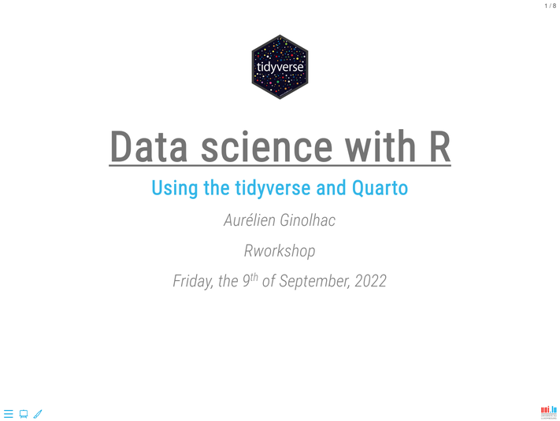

# Quarto reveal.js uni.lu template

A [Quarto](https://quarto.org) extension for authoring [r-training](https://gitlab.lcsb.uni.lu/r-training) Reveal.js presentations at [University of Luxembourg](https://wwwen.uni.lu/)

## Installation

- To start a new presentation in a new folder:

``` bash
quarto use template ginolhac/unilu-theme
```

- To install the theme in an existing folder:

``` bash
quarto install extension ginolhac/unilu-theme
```

## Output



Preview this [Quarto reveal.js theme](https://ginolhac.github.io/unilu-theme) on `gh-pages`.

## Acknowledgements

-   [Romain Lesur](https://github.com/RLesur) for the [onyxia-quarto template](https://github.com/InseeFrLab/onyxia-quarto) 
-   [Mickaël Canouil](https://github.com/mcanouil/) for maintaining the [awesome Quarto](https://github.com/mcanouil/awesome-quarto)
-   [Emi Tanaka](https://github.com/emitanaka) for her [syntax-highlthing CSS](https://github.com/emitanaka/talks/blob/master/Ihaka2022/assets/syntax-highlight.css)

## License

MIT License
